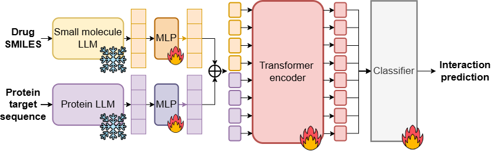

# LANTERN: Leveraging Large Language Models And Transformer For Enhanced Molecular Interaction



Contributors:
* Anonymous member 1
* Anonymous member 2
* Anonymous member 3

The main functionalities from LANTERN include, but not limited to:
- Featurization of ligand SMILES and protein Amino Acids.
- Training process and prediction scripts.
- A simple but effective methods that generalise across molecular interaction tasks (DTI, DDI, PPI, ...).

The main innovations we made away from LANTERN, but not limited to:
- Integration of pretrained LLM embeddings with Transformer-based interaction modeling.
- Broad applicability and SOTA performance.
- Efficiency and independence from 3D structural data.

## Setup Environment
Clone this repository and install dependencies:
```bash
git clone https://github.com/HySonLab/LANTERN.git
cd LANTERN
conda env create -f environment.yaml
conda activate LANTERN
```

## Training

Finally, run the training script:
```
python train.py \
    --num_workers 8 \
    --batch_size 1 \
    --accumulate_grad_batches 8 \
    --save_dir "workdir/train/example_ProteinReDiff" \
    --single_dim 256 \
    --pair_dim 32 \
    --num_blocks 4
```

Please modify the batch_size, gpus, and accumulate_grad_batches arguments according to your machine(s). 
Default values can be used to reproduce the settings used in our paper:

```bash
python train.py \
    --training_mode \
    --num_gpus 1\
    --num_workers 30 \
    --batch_size 2 \
    --accumulate_grad_batches 10 \
    --save_dir "workdir/train/example_ProteinReDiff" \
    --single_dim 512 \
    --mask_prob 0.15 \
    --pair_dim 64 \
    --num_steps 2000 \
    --num_blocks 4
```
Due to the limitation of runtime on GPUs, we prepared a `train_from_ckpt.py` script to further train on finished epoch:


## Acknowledgements

This work is primarily based on the following repositories:

- https://github.com/samsledje/ConPLex.git (BioSNAP, DAVIS - DTI datasets)
- https://github.com/thinng/GraphDTA.git (KIBA - DTI dataset)
- https://github.com/biomed-AI/MUSE.git (DeepDDI - DDI datasets)
- https://github.com/xzenglab/TAGPPI.git (Yeast - PPI dataset)


## Please cite our work as follows

```bibtex
```
